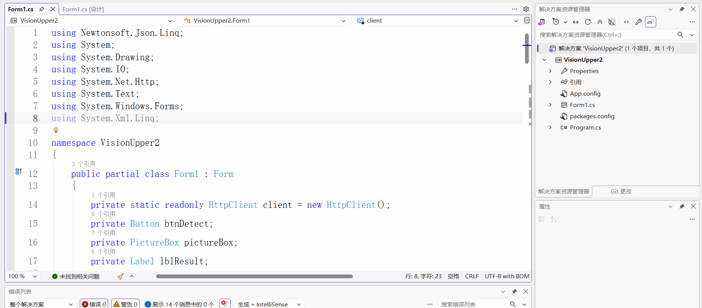
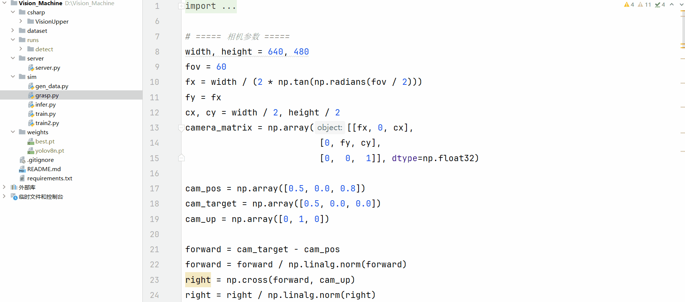

# 视觉引导机械臂抓取系统

基于 PyBullet 仿真 + YOLOv8 检测 + 逆运动学的完整视觉引导抓取系统，
采用 Python（算法）+ C#（上位机）双语言架构。

## 系统架构

```
[PyBullet 仿真场景]
        ↓
[YOLOv8 目标检测] → 2D 检测框
        ↓
[坐标反投影] → 3D 世界坐标（误差 < 2cm）
        ↓
[逆运动学求解] → 关节角度（末端定位误差 2cm）
        ↓
[抓取执行] → 夹爪约束 → 抬起 → 放置
        ↓
[FastAPI 服务] ← HTTP ← [C# WinForms 上位机]
```

## 技术栈

| 层级 | 技术 | 职责 |
|------|------|------|
| 仿真环境 | PyBullet + KUKA iiwa | 场景搭建、物理仿真 |
| 数据生成 | 数学投影 + OpenCV | 3D→2D 投影，生成带标注图像 |
| 目标检测 | YOLOv8n (Ultralytics) | 方块识别，mAP@0.5 = 98.8% |
| 坐标反投影 | 相机模型 + 射线-平面求交 | 2D 像素 → 3D 世界坐标 |
| 运动规划 | PyBullet 逆运动学 | 3D 坐标 → 关节角度 |
| 服务层 | FastAPI + Uvicorn | 封装推理接口 |
| 上位机 | C# WinForms + Newtonsoft.Json | 界面显示、调用服务 |

## 核心流程

### 1. 数据生成

PyBullet 中随机摆放 3 个方块，通过相机投影矩阵将 3D 位置投影到 2D 像素，
用 OpenCV 绘制图像和 YOLO 标注，生成 50 张训练数据。

### 2. 模型训练

YOLOv8n 训练 50 epochs，mAP@0.5 = 98.8%，precision = 99.96%，recall = 99.5%。

### 3. 坐标反投影

从检测框中心像素坐标出发，通过相机内参和外参反投影，
与桌面平面求交得到 3D 世界坐标，误差 < 2cm。

### 4. 逆运动学

将目标 3D 坐标传给 PyBullet 的 calculateInverseKinematics，
求解 7 自由度 KUKA iiwa 的关节角度，末端定位误差 2cm。

### 5. 抓取闭环

视觉检测 → 移动到目标上方 → 下降 → 创建固定约束模拟夹爪 →
抬起 → 移动到放置点 → 解除约束。

## 快速开始

### 环境配置

```bash
conda create -n vision python=3.10 -y
conda activate vision
pip install -r requirements.txt
```

### 生成数据集

```bash
python sim/gen_data.py
```

### 训练检测模型

```bash
python sim/train.py
```

### 运行抓取仿真

```bash
python sim/grasp.py
```

### 启动推理服务

```bash
python server/server.py
```

### 运行 C# 上位机

用 Visual Studio 打开 `csharp/VisionUpper/`，按 F5 运行，点击“检测”。

## 效果展示

### C# 上位机检测结果



### 机械臂抓取过程



## 关键技术点

- **为什么用数学投影代替 PyBullet 渲染**：PyBullet 在 Windows 下的
  TINY_RENDERER 对光照支持差，渲染结果为空白；改用 3D→2D 数学投影
  直接绘制，标注精度更高，且不依赖渲染器。
- **为什么用约束模拟抓取**：KUKA iiwa 本身不带夹爪，
  用 `p.createConstraint` 建立固定约束可快速验证完整抓取流程。
- **为什么 Python + C# 分离**：Python 的 AI 生态更成熟，
  C# 的 WinForms 在工控现场部署更稳定，两者通过 HTTP 解耦。

## 项目结构

```
Vision_Machine/
├── README.md
├── requirements.txt
├── sim/
│   ├── gen_data.py       # 数据生成
│   ├── train.py          # YOLOv8 训练
│   └── grasp.py          # 抓取闭环
├── server/
│   └── server.py         # FastAPI 推理服务
├── csharp/
│   └── VisionUpper/      # C# 上位机
├── dataset/
│   ├── data.yaml
│   ├── images/
│   └── labels/
└── weights/
    └── best.pt
```

## 后续计划

- [ ] 替换为 Franka Panda + 真实夹爪模型
- [ ] 增加实时摄像头输入
- [ ] 支持多目标连续抓取
- [ ] 增加错误处理和重试机制